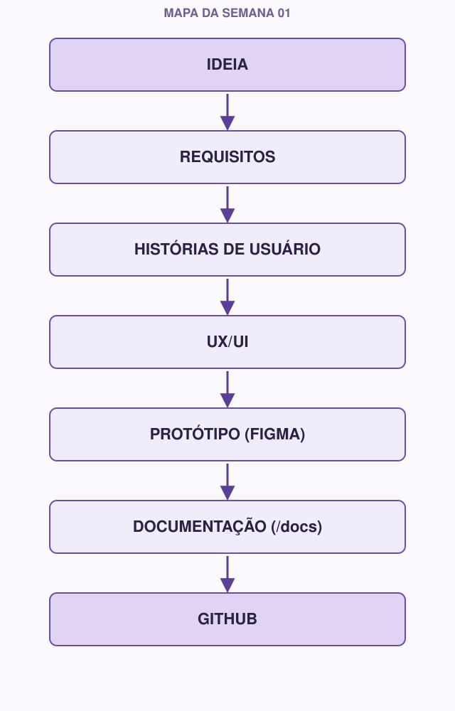

# 00 — Comece aqui

Bem-vindo(a) à Semana 01 do **Coffee & Code** ☕

Este documento é o seu ponto de partida. Leia ele inteiro antes de abrir qualquer outro módulo — ele explica o que você vai construir, por que os assuntos da semana estão na ordem em que estão, e o que vai precisar entregar no final.

---

## O que você vai construir

Ao longo desta semana, você (sozinho ou em equipe) vai dar os primeiros passos de um projeto de software **antes de escrever qualquer código**. Isso inclui:

- Definir **o problema** que o projeto resolve e **quem** vai usá-lo.
- Escrever isso em forma de **requisitos** e **histórias de usuário**.
- Pensar no **fluxo de uso** (UX) e desenhar as primeiras telas (UI).
- Criar um **protótipo navegável no Figma**.
- Documentar tudo isso dentro do repositório do projeto, em uma pasta `/docs`.
- Organizar esse repositório no **GitHub**, usando **Git** para versionar o trabalho.

No fim da semana, você não vai ter uma linha de código funcional — e está tudo bem. Você vai ter algo mais importante para começar bem: **clareza sobre o que construir e por quê**.

## Por que essa ordem

Um erro comum de quem está começando é abrir o editor de código no primeiro dia e sair digitando. O problema é que, sem responder antes "para quem eu estou construindo isso?" e "o que essa pessoa precisa fazer?", é muito fácil construir a coisa errada — ou construir a coisa certa de um jeito confuso.

Todo projeto de software real segue (de forma mais ou menos explícita) este caminho:

```
problema → requisitos → usuário → interface → documentação → organização do projeto → código
```

Essa semana existe para você viver esse caminho uma vez, do começo, em um projeto pequeno — para que, quando chegar a hora de programar (semana 02 em diante), você já saiba o que está construindo e por quê.

## Mapa da semana



Cada seta desse mapa é um módulo desta semana. Nenhum módulo existe sozinho — cada um alimenta o próximo.

## Ordem dos módulos

Você vai notar que a ordem dos arquivos não é exatamente igual à ordem do mapa acima. Isso é proposital.

| Ordem | Módulo | Por quê nessa posição |
|---|---|---|
| 01 | Git | Antes de produzir qualquer conteúdo, você precisa saber guardar o histórico dele |
| 02 | GitHub | Onde esse histórico vai morar e ser compartilhado com a equipe |
| 03 | Markdown | A "linguagem" que você vai usar para documentar tudo dentro do GitHub |
| 04 | Requisitos | O ponto de partida real do projeto: o problema e o que precisa ser resolvido |
| 05 | UX/UI | Como pensar no uso do sistema antes de desenhar qualquer tela |
| 06 | Figma | A ferramenta para transformar esse pensamento em um protótipo |
| 07 | Design System | Consistência visual entre as telas que você acabou de criar |
| 08 | Arquitetura inicial | Como tudo isso começa a virar uma visão de sistema (mais forte para veteranos) |

Ou seja: primeiro você monta a "estante" (Git, GitHub, Markdown) onde o trabalho vai ficar guardado, depois você produz o conteúdo (Requisitos, UX/UI, Figma, Design System, Arquitetura) e guarda cada peça na estante à medida que avança.

## Ferramentas que você vai usar

- **Git** — instalado na sua máquina ([git-scm.com](https://git-scm.com))
- **GitHub** — conta gratuita ([github.com](https://github.com))
- **Figma** — conta gratuita ([figma.com](https://figma.com)), pode ser usado direto no navegador
- Um editor de texto qualquer para escrever Markdown (VS Code é uma boa escolha, mas não é obrigatório)

Você não precisa instalar nada além de Git. GitHub e Figma funcionam no navegador.

## Duas trilhas, um projeto só

Ao longo dos módulos você vai ver dois símbolos:

- 🌱 **Se você está começando** — explicações mais detalhadas, sem pressa, sem assumir que você já viu aquilo antes.
- ⚡ **Se você já tem experiência** — aprofundamentos, boas práticas extras e desafios para quem já manja do básico.

Isso não significa dois cursos diferentes. Todo mundo trabalha **no mesmo projeto**. A diferença é só o nível de profundidade em cada parte. Se você é veterano, ainda vale ler as partes 🌱 — muita gente experiente pula etapas de fundamentos e sente falta delas depois.

## O que você vai entregar no final

1. **Pasta `/docs`** dentro do repositório do projeto, com pelo menos:
   - `requisitos.md`
   - `historias-de-usuario.md`
   - `design-system.md`
   - (o `arquitetura.md` é esperado principalmente dos veteranos, mas todo mundo pode começar o seu)
2. **Protótipo inicial no Figma**, navegável, representando as telas principais definidas nos requisitos.

Não precisa estar perfeito. Precisa existir e fazer sentido com o que você definiu ao longo da semana.

## Como estudar

Como o Coffee & Code é majoritariamente assíncrono, cada módulo foi escrito para ser autossuficiente: você pode estudar sozinho, no seu ritmo, sem depender de estar em uma call. Os encontros semanais existem para tirar dúvidas e mostrar o que você produziu — não para "dar a aula".

Sugestão de ritmo (ajuste ao seu tempo disponível):

- [ ] Dia 1-2: Módulos 01, 02 e 03 (Git, GitHub, Markdown)
- [ ] Dia 3: Módulo 04 (Requisitos)
- [ ] Dia 4: Módulos 05 e 06 (UX/UI e Figma)
- [ ] Dia 5: Módulo 07 (Design System)
- [ ] Dia 6: Módulo 08 (Arquitetura, principalmente veteranos) e revisão geral
- [ ] Dia 7: Finalizar entregável e, se disponível, fazer o CHECKPOINT

Quando terminar os módulos, veja `desafios.md` (para se aprofundar) e `entregavel.md` (checklist final antes de entregar).

---

**Próximo módulo:** `01-git.md`
