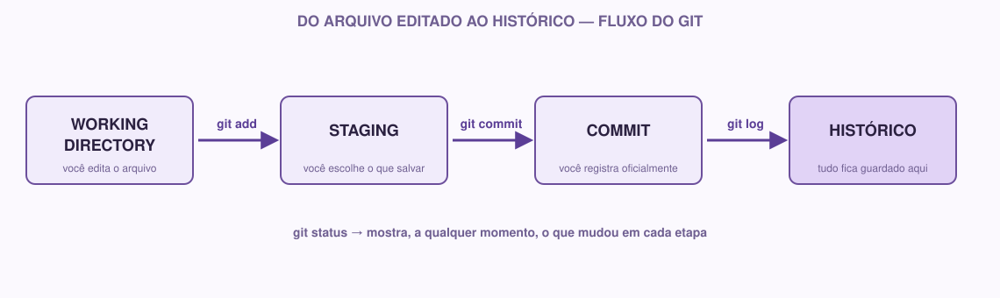

# 01 — Git

> Módulo anterior: `00-comece-aqui.md` · Próximo módulo: `02-github.md`

## O que é

Imagine que você está escrevendo um trabalho e vai salvando várias versões dele: `trabalho.docx`, `trabalho_final.docx`, `trabalho_final_v2.docx`, `trabalho_final_agora_vai.docx`. Isso é, na prática, uma forma (bem ruim) de controle de versão manual.

**Git é um programa que faz isso de forma organizada.** Ele guarda o histórico de todas as mudanças feitas em um projeto, para que você possa:

- Ver exatamente o que mudou, quando e por quem.
- Voltar para uma versão anterior se algo quebrar.
- Trabalhar em conjunto com outras pessoas no mesmo projeto sem sobrescrever o trabalho umas das outras.

Isso se chama **controle de versão**. Git é o sistema de controle de versão mais usado no mundo hoje.

## Por que usamos

Em qualquer projeto que dure mais de um dia ou envolva mais de uma pessoa, algumas perguntas aparecem naturalmente:

- "Essa função funcionava ontem, o que eu mudei que quebrou?"
- "Eu e meu colega editamos o mesmo arquivo ao mesmo tempo, e agora?"
- "Eu apaguei um trecho importante sem querer, dá pra recuperar?"

Sem controle de versão, a resposta costuma ser "não" ou "só na base do estresse". Com Git, essas perguntas têm resposta:

- Você compara versões com `git log` e `git diff`.
- Git ajuda a **combinar** mudanças de pessoas diferentes (merge).
- Todo o histórico fica salvo — nada se perde de fato.

🌱 **Se você está começando:** não se preocupe em entender tudo de uma vez. Neste módulo você só vai usar Git localmente, sozinho, no seu computador. A parte de trabalhar em equipe vem com calma no módulo de GitHub.

## Exemplo real

Imagine que você está construindo o site do Coffee & Code. No dia 1, você cria a página inicial. No dia 3, decide mudar a cor de fundo — mas depois de mexer, percebe que a versão antiga ficava melhor.

Sem Git: você teria que lembrar exatamente qual era o código de cor antigo (ou torcer para ter uma cópia salva em algum lugar).

Com Git: você roda um comando, volta para a versão de antes da mudança, e segue o projeto normalmente. O histórico inteiro está guardado, passo a passo.

## Conceitos que você precisa entender antes dos comandos

Antes de sair digitando comandos, vale entender quatro palavras que aparecem o tempo todo em Git:

### Repositório (repo)

É a pasta do seu projeto, mas com um "superpoder": o Git está observando tudo o que acontece dentro dela e guardando o histórico das mudanças. Um repositório pode estar só no seu computador (**repositório local**) ou também existir em um servidor, como o GitHub (**repositório remoto** — isso é assunto do próximo módulo).

### Working directory (diretório de trabalho)

É simplesmente os arquivos do seu projeto, do jeito que estão agora, na pasta, no seu computador. Se você abre um arquivo e edita uma linha, essa mudança está acontecendo no working directory — o Git já percebeu que algo mudou, mas ainda não "guardou" oficialmente essa mudança no histórico.

### Staging (área de preparação)

Pense nisso como uma "caixa de envio". Antes de registrar oficialmente uma mudança no histórico, você escolhe quais arquivos (ou quais mudanças) quer incluir nesse registro. Colocar um arquivo no staging é dizer para o Git: "isso aqui eu quero que entre no próximo registro do histórico".

Por que isso existe? Porque nem sempre você quer salvar *todas* as mudanças de uma vez. Talvez você tenha editado três arquivos, mas só dois deles estão prontos para virar um registro. O staging deixa você escolher.

### Commit

É o registro em si. Um commit é uma "foto" do projeto naquele momento, com uma mensagem explicando o que mudou. É a unidade básica do histórico do Git.

Juntando tudo:



## Como fazer

### Instalando o Git

Se ainda não tem o Git instalado:

- **Windows:** baixe em [git-scm.com](https://git-scm.com) e instale normalmente (pode deixar as opções padrão).
- **Mac:** abra o Terminal e digite `git --version`. Se não estiver instalado, o próprio sistema vai oferecer para instalar.
- **Linux:** `sudo apt install git` (Ubuntu/Debian) ou equivalente da sua distribuição.

Para confirmar que funcionou, abra o terminal e digite:

```bash
git --version
```

Isso deve mostrar algo como `git version 2.43.0`. Se aparecer um número de versão, está tudo certo.

### `git init` — criando um repositório

Vá até a pasta do seu projeto pelo terminal e digite:

```bash
git init
```

Isso transforma a pasta atual em um repositório Git. O que acontece por trás: o Git cria uma pasta escondida chamada `.git` dentro do seu projeto, onde ele vai guardar todo o histórico. Você não precisa mexer nela diretamente.

### `git status` — o que está acontecendo agora

```bash
git status
```

Esse comando é o seu melhor amigo. Ele mostra:

- Quais arquivos foram modificados.
- Quais arquivos estão no staging (prontos para virar commit).
- Quais arquivos ainda não estão sendo rastreados pelo Git.

Use `git status` sempre que tiver dúvida sobre o que está acontecendo. Não existe uso "errado" desse comando — ele só olha e informa, não muda nada.

### `git add` — colocando no staging

```bash
git add nome-do-arquivo.md
```

Isso coloca o arquivo especificado no staging (a "caixa de envio" que vimos acima).

Para colocar **todos** os arquivos modificados de uma vez:

```bash
git add .
```

O `.` significa "a pasta atual e tudo dentro dela".

### `git commit` — registrando a mudança

```bash
git commit -m "Cria estrutura inicial do projeto"
```

O `-m` é seguido da **mensagem do commit** — uma frase curta explicando o que essa mudança faz. Boas mensagens de commit descrevem a ação, não o sentimento: `"Corrige erro no cálculo do total"` é melhor que `"ajustes"` ou `"funciona agora"`.

### `git log` — vendo o histórico

```bash
git log
```

Mostra a lista de commits feitos, do mais recente para o mais antigo, com autor, data e mensagem. Para uma versão mais compacta:

```bash
git log --oneline
```

## Git ≠ GitHub

Essa confusão é extremamente comum, então vale deixar bem claro:

- **Git** é o programa que roda no seu computador e controla o histórico de versões. Funciona até sem internet.
- **GitHub** é um site que hospeda repositórios Git na nuvem, permitindo compartilhar seu código, colaborar com outras pessoas e guardar um backup remoto do seu projeto.

Ou seja: Git é a ferramenta, GitHub é um lugar (entre vários possíveis — existem alternativas como GitLab e Bitbucket) onde você pode guardar e compartilhar o que o Git está controlando.

## 🌱 Se você está começando

Não existe problema em errar um comando ou ficar confuso com `git status` no início — isso é normal para todo mundo. Uma dica: sempre que for mexer em algo novo, rode `git status` antes e depois do comando, para ver exatamente o que mudou. Isso constrói intuição rápido.

## ⚡ Se você já tem experiência

Alguns pontos para você prestar atenção desde já, mesmo que a fundo isso venha depois:

- Pense em mensagens de commit como parte da documentação do projeto — um bom histórico de commits conta a história de como o projeto foi construído.
- Comece a se acostumar a fazer commits pequenos e frequentes, em vez de um commit gigante no final do dia. Isso facilita voltar atrás se algo quebrar.
- Vale já configurar seu nome e e-mail globalmente:
  ```bash
  git config --global user.name "Seu Nome"
  git config --global user.email "seu@email.com"
  ```

## Pratique você mesmo

1. Crie uma pasta chamada `pratica-git` no seu computador.
2. Rode `git init` dentro dela.
3. Crie um arquivo `anotacoes.md` com uma frase qualquer dentro.
4. Rode `git status` e observe o que aparece.
5. Rode `git add anotacoes.md` e depois `git status` de novo — repare na diferença.
6. Faça seu primeiro commit: `git commit -m "Primeiro commit de teste"`.
7. Edite o arquivo `anotacoes.md`, adicionando mais uma linha.
8. Rode `git status` de novo. O que mudou?
9. Adicione e commite essa mudança.
10. Rode `git log --oneline` e veja os dois commits que você acabou de criar.

> 💡 Guarde `cheatsheet-git-github.md` (ou a imagem em `assets/cheatsheet-git-github.svg`) como referência rápida — não precisa decorar os comandos.

**Checklist do módulo:**

- [ ] Git instalado e `git --version` funcionando
- [ ] Entendi a diferença entre working directory, staging e commit
- [ ] Fiz pelo menos dois commits em uma pasta de prática
- [ ] Entendi a diferença entre Git e GitHub

---

**Próximo módulo:** `02-github.md` — vamos levar esse repositório local para a nuvem.
