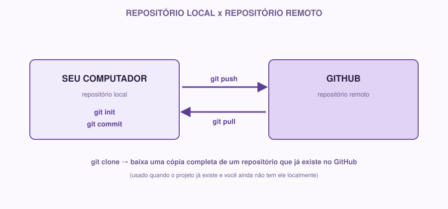

# 02 — GitHub

> Módulo anterior: `01-git.md` · Próximo módulo: `03-markdown.md`

## O que é

No módulo anterior, você criou um repositório Git **local** — ele existe só no seu computador. Se seu HD falhar amanhã, esse histórico some junto.

**GitHub é um site que hospeda repositórios Git na nuvem.** Ele permite que você:

- Tenha uma cópia do seu projeto guardada fora do seu computador.
- Compartilhe esse projeto com outras pessoas.
- Trabalhe em equipe no mesmo repositório, sem trocar arquivos por WhatsApp ou pen drive.
- Acompanhe tarefas, bugs e ideias através de **Issues**.

## Por que usamos

Pensa numa equipe de 4 pessoas trabalhando no mesmo projeto. Sem um lugar central:

- Como cada pessoa sabe qual é a versão mais atual do código?
- Como vocês combinam o trabalho de cada um sem sobrescrever o que o outro fez?
- Onde fica o histórico de decisões, bugs encontrados e tarefas pendentes?

O GitHub resolve isso sendo o "ponto de encontro" do projeto: todo mundo manda (`push`) suas mudanças para lá e busca (`pull`) as mudanças dos outros a partir de lá.

## Exemplo real

Você e mais duas pessoas estão criando o app do Coffee & Code. Cada um trabalha em uma parte diferente: uma pessoa mexe na tela de login, outra na tela de perfil, outra escreve a documentação. Sem GitHub, vocês teriam que ficar enviando arquivos um para o outro e torcer para não sobrescrever nada. Com GitHub, cada um trabalha na sua parte, envia (`push`) suas mudanças, e o repositório central vai juntando o trabalho de todo mundo.

## Conceitos principais

### Repositório remoto

É a versão do seu repositório que fica hospedada no GitHub, em vez de só no seu computador. Você pode ter um repositório local e um remoto conectados — mudanças em um podem ser enviadas ou trazidas para o outro.



### Clone

**Clonar** é baixar uma cópia completa de um repositório que já existe no GitHub para o seu computador — incluindo todo o histórico de commits.

```bash
git clone https://github.com/usuario/nome-do-repositorio.git
```

Use isso quando o projeto **já existe** no GitHub e você quer trabalhar nele localmente (por exemplo, entrando em um projeto de equipe que já está em andamento).

### Push

**Push** é enviar seus commits locais para o repositório remoto no GitHub.

```bash
git push
```

Pense assim: você fez commits no seu computador (histórico local). O `push` sincroniza esse histórico com o GitHub, para que outras pessoas (e você, de outro computador) possam ver essas mudanças.

### Pull

**Pull** é o caminho contrário: trazer as mudanças que estão no GitHub (feitas por você ou por outras pessoas) para o seu computador.

```bash
git pull
```

Regra prática: sempre dê um `pull` antes de começar a trabalhar, para garantir que você está partindo da versão mais atual do projeto.

### Branches (introdução)

Uma **branch** ("ramo", em inglês) é uma linha paralela de desenvolvimento. Por padrão, todo repositório tem uma branch principal (geralmente chamada `main`). Quando você quer testar algo novo sem arriscar quebrar o que já funciona, você cria uma branch separada, trabalha nela, e só depois junta (`merge`) essas mudanças de volta na `main`.

```bash
git branch nome-da-branch     # cria uma branch nova
git checkout nome-da-branch   # muda para essa branch
# ou, em um comando só:
git checkout -b nome-da-branch
```

🌱 Nesta semana você não precisa dominar branches — só entender que elas existem e para que servem. Vamos aprofundar em semanas futuras.

### README

O `README.md` é o primeiro arquivo que qualquer pessoa vê ao abrir seu repositório no GitHub. Ele deve responder rapidamente: o que é esse projeto, como rodar, e onde encontrar mais informação. É o "cartão de visitas" do repositório.

### Issues

**Issues** são como uma lista de tarefas/problemas do projeto, dentro do próprio GitHub. Cada issue é um item específico — um bug para corrigir, uma funcionalidade para implementar, uma dúvida para resolver. Issues podem ser atribuídas a pessoas, ter etiquetas (labels) e serem fechadas quando resolvidas.

Exemplo de issue:

```
Título: Botão de login não funciona no mobile
Descrição: Ao clicar em "Entrar" em telas pequenas, nada acontece.
Esperado: O clique deveria abrir o formulário de login.
```

## Como fazer

### 1. Criando uma conta

Crie uma conta gratuita em [github.com](https://github.com), se ainda não tiver.

### 2. Criando um repositório no GitHub

No GitHub, clique em **New repository**. Dê um nome, escolha se será público ou privado, e marque a opção de criar um `README.md` inicial.

### 3. Conectando seu repositório local a um repositório remoto

Se você já tem um repositório local (do módulo 01) e quer conectá-lo a um repositório recém-criado no GitHub:

```bash
git remote add origin https://github.com/seu-usuario/nome-do-repo.git
git push -u origin main
```

`origin` é só um apelido para o endereço do repositório remoto — é o nome padrão usado pela comunidade.

### 4. Organização básica de um projeto

Uma estrutura simples para começar:

```
nome-do-projeto/
├── README.md
├── docs/
│   ├── requisitos.md
│   ├── historias-de-usuario.md
│   ├── arquitetura.md
│   └── design-system.md
└── (o restante do código virá nas próximas semanas)
```

## 🌱 Se você está começando

Se a ideia de linha de comando ainda intimida, saiba que o GitHub também tem uma interface visual (GitHub Desktop) que faz `add`, `commit`, `push` e `pull` com botões, sem digitar comandos. É válido usar no começo — mas vale a pena entender o que cada botão faz por trás, porque os comandos aparecem em praticamente todo lugar que fala sobre desenvolvimento.

## ⚡ Se você já tem experiência

Para os veteranos, vale aprofundar em quatro pontos que fazem diferença em projetos reais:

**Convenções de nomenclatura.** Nomes de branches consistentes (`feature/login`, `fix/bug-cadastro`), mensagens de commit em um padrão (por exemplo, [Conventional Commits](https://www.conventionalcommits.org/): `feat: adiciona tela de login`, `fix: corrige validação de email`).

**Estrutura de pastas pensada desde o início**, mesmo que ainda não haja código — isso facilita a vida de quem entrar no projeto depois:

```
projeto/
├── docs/
├── src/          # código-fonte (virá nas próximas semanas)
├── tests/        # testes (virá também)
├── .gitignore
└── README.md
```

**Pull Requests (PR).** Em vez de dar `push` direto na branch principal, o fluxo profissional é: criar uma branch, fazer as mudanças, e abrir um **Pull Request** pedindo para essas mudanças serem revisadas e incorporadas à `main`. Isso permite revisão de código antes de qualquer coisa entrar no projeto principal. Vamos praticar isso ativamente a partir da Semana 02, mas já vale criar o hábito de pensar em branches + PR em vez de commit direto na `main`.

**Organização do projeto.** Defina desde já: como você vai usar issues para acompanhar o que falta fazer, e onde ficam registradas decisões técnicas (uma boa resposta: dentro do próprio `/docs`, em um arquivo de decisões).

## Pratique você mesmo

1. Crie uma conta no GitHub (se ainda não tiver).
2. Crie um repositório novo chamado `coffee-code-sem01` (pode ser público).
3. Clone esse repositório para o seu computador.
4. Dentro dele, crie a pasta `docs/` (vazia por enquanto, ou com um arquivo `.gitkeep`).
5. Faça um commit dessa mudança e dê `push` para o GitHub.
6. Confira no site do GitHub se a pasta `docs/` aparece lá.
7. Crie uma Issue no seu repositório descrevendo a primeira tarefa da semana, por exemplo: "Definir requisitos do projeto".

⚡ Se você é veterano, adicione também: crie uma branch chamada `docs/estrutura-inicial`, faça as mudanças acima dentro dela, e depois abra um Pull Request da sua branch para a `main` (não precisa fazer merge ainda, só praticar a criação do PR).

> 💡 Veja também `cheatsheet-git-github.md` para uma referência rápida de todos os comandos de Git e GitHub desta semana, lado a lado.

**Checklist do módulo:**

- [ ] Conta no GitHub criada
- [ ] Repositório `coffee-code-sem01` criado e clonado localmente
- [ ] Pasta `docs/` criada, commitada e enviada (`push`) para o GitHub
- [ ] Pelo menos uma Issue criada
- [ ] ⚡ Veteranos: branch e Pull Request criados

---

**Próximo módulo:** `03-markdown.md` — vamos aprender a escrever essa documentação de verdade.
