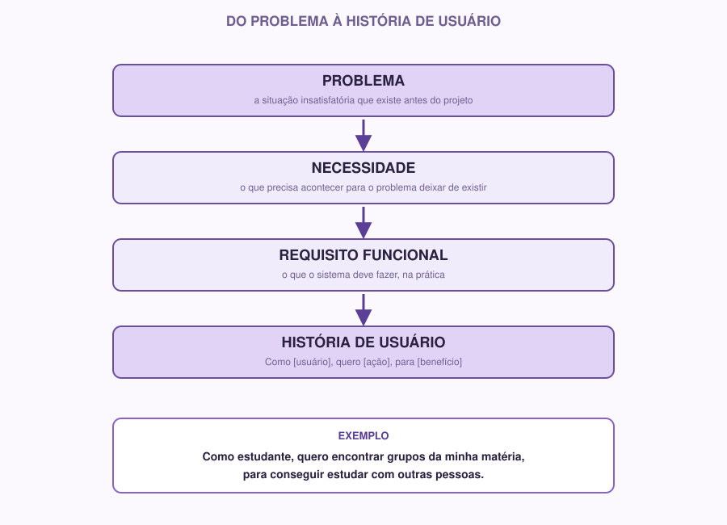

# 04 — Engenharia de Requisitos

> Módulo anterior: `03-markdown.md` · Próximo módulo: `05-ux-ui.md`

## Comece pelo problema

Imagine a seguinte situação:

> Uma empresa quer construir um sistema. Antes de programar, como sabemos o que precisa ser feito?

Parece óbvio, mas essa é a pergunta que mais projetos de software erram na prática. É extremamente comum uma equipe passar semanas programando algo que, no final, não resolve o problema de ninguém — porque ninguém parou para definir com clareza qual era o problema antes de sair codando.

**Engenharia de Requisitos** é justamente a etapa de descobrir e escrever, com clareza, o que um sistema precisa fazer, antes de começar a construir.

## Por que usamos

Sem requisitos claros:

- Cada pessoa da equipe entende "o projeto" de um jeito diferente.
- É fácil construir funcionalidades que ninguém pediu, enquanto o que realmente importa fica de fora.
- Fica difícil saber quando o projeto está "pronto" — pronto para quê, exatamente?

Com requisitos bem definidos, você tem um documento de referência: sempre que surgir dúvida sobre "isso deveria fazer parte do projeto?", a resposta está ali.

## Os conceitos, um de cada vez

### Problema

É a situação insatisfatória que existe **antes** do projeto — a dor que motivou a ideia. Um problema não é uma solução disfarçada. "Os alunos não têm um app" não é um problema, é já uma solução (o app). O problema por trás poderia ser: "alunos têm dificuldade de encontrar grupos de estudo".

### Necessidade

É o que precisa acontecer para que o problema deixe de existir. Do problema acima: "alunos precisam de um jeito fácil de encontrar outras pessoas estudando a mesma matéria".

### Stakeholder

É qualquer pessoa ou grupo que tem interesse ou é afetado pelo projeto. Nem todo stakeholder é usuário direto do sistema. Exemplos em um app de grupos de estudo:

- **Usuários diretos:** estudantes que vão usar o app.
- **Outros stakeholders:** coordenação do curso (pode querer relatórios de uso), monitores (podem ser responsáveis por aprovar grupos).

### Requisito

É uma condição ou capacidade que o sistema precisa ter. Requisitos são divididos em dois tipos:

### Requisito funcional

Descreve **o que o sistema faz** — uma ação, uma funcionalidade.

Exemplos:
- O sistema deve permitir que o usuário crie uma conta.
- O sistema deve permitir a criação de grupos por matéria.
- O sistema deve enviar uma notificação quando alguém entrar no grupo.

### Requisito não funcional

Descreve **como** o sistema deve se comportar — qualidades, restrições, características gerais que não são uma ação específica.

Exemplos:
- O sistema deve carregar a lista de grupos em menos de 2 segundos.
- O sistema deve funcionar corretamente em celulares com tela pequena.
- As senhas dos usuários devem ser armazenadas de forma criptografada.
- O sistema deve estar disponível em português.

Uma forma simples de lembrar a diferença: requisito funcional é **o quê**, requisito não funcional é **quão bem** ou **sob quais condições**.

### História de usuário

É uma forma de escrever um requisito funcional **da perspectiva de quem vai usar o sistema**, em vez de escrever como uma instrução técnica fria. O formato padrão é:

```
Como [tipo de usuário], quero [objetivo], para [benefício].
```

Por exemplo, em vez de escrever:

> "O sistema deve permitir a busca de grupos por matéria."

Você escreve:

> "Como estudante, quero buscar grupos pela matéria que estou cursando, para encontrar rapidamente pessoas estudando o mesmo conteúdo que eu."

A diferença pode parecer pequena, mas é importante: a história de usuário força você a pensar em **quem** precisa disso e **por quê**, não só **o quê**. Isso ajuda a não perder de vista o problema original enquanto o projeto avança.



## Exemplo real, do começo ao fim

**Problema:** Alunos têm dificuldade de encontrar grupos de estudo.

**Usuário principal:** Estudantes universitários.

**Requisitos funcionais:**
- O sistema deve permitir a criação de grupos por matéria.
- O sistema deve permitir que estudantes encontrem grupos existentes.
- O sistema deve permitir que usuários participem de um grupo.

**Requisito não funcional:**
- O sistema deve ser utilizável em celulares, já que a maioria dos alunos vai acessar pelo smartphone entre aulas.

**Histórias de usuário:**
- Como estudante, quero encontrar grupos da minha matéria, para conseguir estudar com outras pessoas.
- Como estudante, quero criar um grupo novo quando nenhum existir ainda, para reunir colegas interessados no mesmo assunto.

Repare que cada história de usuário está diretamente ligada a um dos requisitos funcionais acima — elas não são inventadas soltas, são a mesma informação vista de um ângulo mais próximo de quem vai usar o sistema.

## Como fazer

1. **Escreva o problema em uma frase.** Se não conseguir resumir em uma frase, provavelmente ainda não está claro o suficiente.
2. **Identifique o usuário principal** — se houver mais de um tipo de usuário, identifique todos, mas escolha um como foco principal desta semana.
3. **Liste de 3 a 6 requisitos funcionais.** Comece pelos mais essenciais — o que o sistema *precisa* fazer para resolver o problema, sem o qual ele não faz sentido.
4. **Identifique 1 a 3 requisitos não funcionais** relevantes para o seu projeto (desempenho, segurança, acessibilidade, compatibilidade, etc.).
5. **Transforme os requisitos funcionais principais em histórias de usuário**, usando o formato `Como [usuário], quero [ação], para [benefício]`.
6. **Escreva tudo isso em `docs/requisitos.md` e `docs/historias-de-usuario.md`.**

Sugestão de estrutura para `docs/requisitos.md`:

```markdown
# Requisitos do Projeto

## Problema

[uma frase clara]

## Público-alvo

[quem é o usuário principal]

## Requisitos Funcionais

- O sistema deve...
- O sistema deve...

## Requisitos Não Funcionais

- O sistema deve...
```

E para `docs/historias-de-usuario.md`:

```markdown
# Histórias de Usuário

Como [usuário], quero [ação], para [benefício].

Como [usuário], quero [ação], para [benefício].
```

## 🌱 Se você está começando

É normal, na primeira tentativa, escrever requisitos vagos demais ("o sistema deve ser bom") ou específicos demais demais ("o botão deve ser azul #1E90FF" — isso é decisão de design, não requisito). Um bom teste: leia seu requisito e pergunte "dá para saber se isso foi cumprido ou não?". Se a resposta for clara, o requisito está bem escrito.

## ⚡ Se você já tem experiência

Alguns pontos para aprofundar:

- **Priorização.** Nem todo requisito tem o mesmo peso. Marque quais são essenciais para uma primeira versão (MVP) e quais são "desejáveis, mas não urgentes". Uma técnica simples é o método **MoSCoW**: Must have, Should have, Could have, Won't have (por enquanto).
- **Rastreabilidade.** Cada requisito deveria poder ser conectado a uma história de usuário e, futuramente, a uma tela do protótipo e a uma tarefa/issue no GitHub. Isso evita "requisitos órfãos" que ninguém sabe de onde vieram.
- **Ambiguidade é o inimigo.** Releia seus requisitos como se fosse outra pessoa lendo pela primeira vez — existe alguma frase que poderia ser interpretada de duas formas diferentes?

## Atividade

Escolha uma funcionalidade central do projeto do seu grupo (ou, se ainda não tem um projeto definido, escolha uma ideia simples — por exemplo, um sistema para organizar os próprios encontros do Coffee & Code) e:

1. Escreva o problema que ela resolve, em uma frase.
2. Escreva de 3 a 5 requisitos funcionais relacionados a essa funcionalidade.
3. Escreva pelo menos 1 requisito não funcional relevante.
4. Transforme os requisitos funcionais principais em 2 a 3 histórias de usuário, no formato `Como [usuário], quero [ação], para [benefício]`.
5. Salve tudo em `docs/requisitos.md` e `docs/historias-de-usuario.md`, faça commit e push.

Essas histórias de usuário vão ser exatamente a base para o protótipo que você vai criar no módulo de Figma — não são um exercício isolado.

**Checklist do módulo:**

- [ ] Problema do projeto escrito em uma frase
- [ ] Usuário principal identificado
- [ ] Requisitos funcionais listados
- [ ] Ao menos 1 requisito não funcional listado
- [ ] Histórias de usuário escritas no formato padrão
- [ ] `docs/requisitos.md` e `docs/historias-de-usuario.md` preenchidos, commitados e enviados

---

**Próximo módulo:** `05-ux-ui.md` — vamos pensar em como o usuário vai realmente usar isso.
