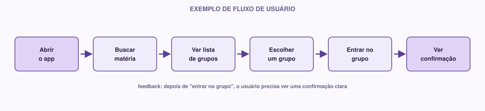

# 05 — UX/UI

> Módulo anterior: `04-requisitos.md` · Próximo módulo: `06-figma.md`

Este módulo não é um curso completo de design — é o suficiente para você tomar decisões melhores no protótipo que vai criar no próximo módulo.

## O que é

**UX** (User Experience, "experiência do usuário") é sobre **como** é usar o sistema: é fácil entender o que fazer? A pessoa consegue completar a tarefa sem se confundir? Ela sabe se uma ação deu certo?

**UI** (User Interface, "interface do usuário") é o que a pessoa efetivamente vê e toca: os botões, cores, textos, ícones, layout das telas.

## Diferença entre os dois

Uma forma simples de entender a diferença: UX é o **raciocínio**, UI é o **resultado visual** desse raciocínio.

Exemplo: um app de delivery de comida.

- **UX** decide: depois que o usuário faz o pedido, ele precisa saber que o pedido foi recebido, quanto tempo vai levar, e ter um jeito de acompanhar o status. Essa é a experiência que faz sentido.
- **UI** decide: como isso aparece na tela — uma barra de progresso, cores usadas para indicar "em preparo" vs "a caminho", o tamanho da fonte do texto "Pedido confirmado!".

É possível ter uma UI bonita com UX ruim (uma tela linda, mas confusa, onde o usuário não sabe o que clicar) — e o contrário também: um fluxo muito bem pensado, mas com uma interface visualmente pobre. O objetivo é ter os dois trabalhando juntos.

## Conceitos principais

### Fluxo do usuário

É o caminho que a pessoa percorre dentro do sistema para completar uma tarefa. Por exemplo, o fluxo de "entrar em um grupo de estudos":

```
Abrir o app → buscar matéria → ver lista de grupos → escolher um grupo → entrar no grupo → receber confirmação
```

Pensar no fluxo **antes** de desenhar qualquer tela evita um erro comum: criar telas isoladas, bonitas, mas que não se conectam de um jeito lógico.

### Wireframe

É um esboço simples e sem estilo visual de uma tela — só a estrutura: onde fica o título, onde fica o botão, onde fica a lista. Pense em um rascunho em preto e branco, geralmente feito rápido, no papel ou em uma ferramenta simples, antes de qualquer preocupação com cor ou tipografia.

O objetivo do wireframe é validar a **estrutura** (o que está em cada tela e onde) antes de gastar tempo com estética.

### Protótipo

É uma versão navegável (ou quase) do produto, geralmente já com aparência mais próxima do produto final, onde é possível clicar em elementos e "andar" entre as telas como se o sistema já existisse — mesmo que por trás não tenha nenhum código funcional de verdade. É isso que você vai construir no Figma no próximo módulo.

### Consistência visual

Significa que elementos com a mesma função se parecem em todas as telas. Se o botão principal é azul e arredondado na tela de login, ele deveria continuar azul e arredondado na tela de cadastro — não virar verde e quadrado do nada. Inconsistência confunde o usuário, porque ele perde as pistas visuais que aprendeu a reconhecer.

### Feedback

É a resposta que o sistema dá ao usuário depois de uma ação. Toda ação importante precisa de algum tipo de feedback:

- Clicou em "Enviar"? Precisa aparecer algo confirmando que enviou (ou que deu erro).
- Preencheu um campo errado? O sistema precisa indicar qual campo e por quê.

Sem feedback, o usuário fica sem saber se algo funcionou, e tende a clicar de novo (às vezes causando problemas, como enviar um formulário duas vezes).

### Hierarquia visual

É a forma como os elementos de uma tela indicam, pelo tamanho, cor, posição e contraste, o que é mais importante. Um título deve ser visualmente mais forte que um texto secundário; o botão da ação principal deve se destacar mais que um botão de ação secundária ("Cancelar", por exemplo). Quando tudo na tela tem o mesmo peso visual, o usuário não sabe para onde olhar primeiro.

## Exemplo real

Voltando ao app de grupos de estudo, com o requisito: *"Como estudante, quero encontrar grupos da minha matéria, para conseguir estudar com outras pessoas."*

**Fluxo:**



**Decisões de UX/UI derivadas desse fluxo:**
- A busca precisa estar visível assim que o app abre (não escondida em um menu).
- A lista de grupos precisa mostrar informação suficiente para decidir sem precisar clicar em cada um (nome da matéria, quantidade de participantes).
- Depois de clicar em "Participar", o usuário precisa ver uma confirmação clara — senão ele não sabe se funcionou.

Repare que nenhuma dessas decisões dependia ainda de escolher cores ou fontes — isso é UX. As cores e fontes específicas vêm depois, e fazem parte de UI (e do Design System, módulo 07).

## Como fazer

Antes de abrir o Figma, faça esse raciocínio no papel (ou em um arquivo de texto):

1. **Escolha o fluxo principal do seu projeto** — geralmente ligado à história de usuário mais importante que você escreveu no módulo anterior.
2. **Liste as telas necessárias** para esse fluxo, em ordem.
3. **Para cada tela, anote:** o que o usuário vê, o que ele pode fazer ali, e para onde ele vai depois.
4. **Pense no feedback:** em quais pontos do fluxo o sistema precisa confirmar algo para o usuário?

Isso vai direto virar a estrutura do seu protótipo no Figma.

## 🌱 Se você está começando

Não se preocupe em fazer um fluxo "perfeito" ou completo. Pegue só o caminho mais importante do seu sistema — normalmente 3 a 5 telas já são suficientes para representar bem uma funcionalidade central. É melhor um fluxo pequeno bem pensado do que um fluxo gigante e confuso.

## ⚡ Se você já tem experiência

Alguns pontos para aprofundar:

- **Mapeie também os "caminhos alternativos":** o que acontece se a busca não encontrar nenhum grupo? O que acontece se o usuário tentar entrar em um grupo que já está cheio? Esses estados (vazio, erro, carregando) costumam ser esquecidos, mas são parte real da experiência.
- **Pense em affordance:** um elemento clicável deveria "parecer" clicável (sombra, cor, borda) — mesmo antes de qualquer interação, a aparência já comunica o que pode ser feito.
- **Considere acessibilidade desde já:** contraste suficiente entre texto e fundo, tamanho de toque adequado para elementos em telas mobile, textos alternativos em imagens.

## Atividade

1. Pegue a história de usuário principal que você escreveu no módulo 04.
2. Escreva o fluxo completo dessa história, do início ao fim, listando cada tela envolvida.
3. Para cada tela, escreva 2-3 linhas descrevendo: o que aparece, o que o usuário pode fazer, o que acontece a seguir.
4. Identifique pelo menos um ponto do fluxo onde o sistema precisa dar feedback ao usuário.

Guarde essas anotações — elas vão ser a base direta do protótipo no Figma, no próximo módulo.

**Checklist do módulo:**

- [ ] Entendo a diferença entre UX e UI
- [ ] Fluxo principal do projeto mapeado, tela por tela
- [ ] Pontos de feedback identificados
- [ ] ⚡ Veteranos: caminhos alternativos (vazio, erro) considerados

---

**Próximo módulo:** `06-figma.md` — hora de transformar esse fluxo em telas de verdade.
