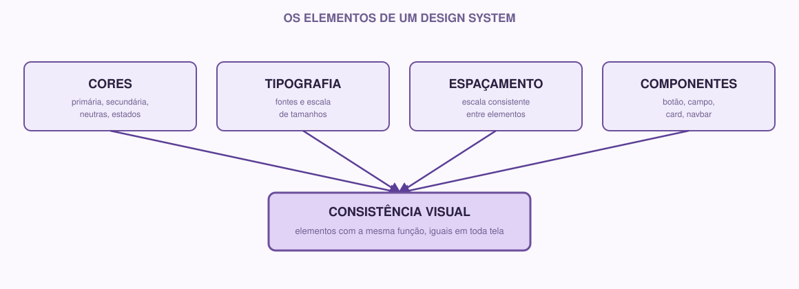

# 07 — Design System

> Módulo anterior: `06-figma.md` · Próximo módulo: `08-arquitetura.md`

## O que é

Depois de criar algumas telas no Figma, é bem provável que você tenha percebido algo: talvez um botão ficou azul em uma tela e verde em outra, ou o espaçamento entre elementos varia sem motivo claro entre uma tela e outra. Isso acontece naturalmente quando cada tela é desenhada sem uma referência em comum.

**Design System** é justamente esse conjunto de decisões e regras visuais — cores, tipografia, espaçamento, componentes — documentadas em um só lugar, para que todas as telas do projeto (e todas as pessoas trabalhando nele) sigam o mesmo padrão.

## Por que usamos

Sem um design system:
- Cada tela nova corre o risco de "inventar" um estilo próprio.
- Fica difícil para outra pessoa da equipe continuar o trabalho de forma consistente.
- Pequenas inconsistências (um botão levemente diferente aqui, outro ali) se acumulam e fazem o produto parecer menos profissional e mais confuso de usar.

Com um design system, essas decisões são tomadas uma vez, documentadas, e reaproveitadas — economizando tempo e garantindo consistência.

## Os elementos de um design system



### Cores

Defina uma paleta pequena e com propósito claro — não é sobre ter muitas cores, é sobre saber exatamente quando usar cada uma. Uma paleta simples e funcional costuma ter:

- **Cor primária** — a cor de destaque principal do produto (usada em botões de ação principal, links, elementos de destaque).
- **Cor secundária** (opcional) — apoio à cor primária.
- **Neutras** — tons de cinza para texto, fundos, bordas.
- **Cores de estado** — verde para sucesso, vermelho para erro/alerta, amarelo para aviso.

Exemplo:

```
Primária:   #2563EB (azul)
Secundária: #F59E0B (laranja)
Neutras:    #FFFFFF, #F3F4F6, #6B7280, #111827
Sucesso:    #16A34A
Erro:       #DC2626
```

### Tipografia

Defina qual(is) fonte(s) o projeto usa, e uma escala de tamanhos para diferentes níveis de texto:

```
Título (H1):     28px, negrito
Subtítulo (H2):  20px, negrito
Corpo de texto:  16px, regular
Texto pequeno:   13px, regular
```

Não é necessário usar mais de uma ou duas fontes diferentes no projeto inteiro.

### Espaçamento

Definir uma escala de espaçamento evita que cada tela use valores aleatórios de espaço entre elementos (8px aqui, 13px ali, 21px acolá). Uma escala comum, baseada em múltiplos de 4 ou 8:

```
4px, 8px, 16px, 24px, 32px, 48px
```

Sempre que for espaçar elementos, escolha um valor dessa escala, em vez de um número aleatório.

### Botões

Defina como o botão principal se parece (cor de fundo, cor do texto, cantos arredondados ou retos, tamanho do texto) — e mantenha essa aparência em todas as telas onde o botão tem a mesma função. Também vale distinguir visualmente um botão de ação principal de um botão secundário (por exemplo, "Confirmar" vs "Cancelar").

### Campos (inputs)

Assim como os botões, os campos de formulário (caixas de texto, seleção, etc.) devem ter uma aparência consistente: borda, espaçamento interno, como aparece quando está em foco (o usuário clicou nele) e como aparece quando há um erro de validação.

### Componentes

São as peças reutilizáveis construídas a partir das decisões acima: o botão, o campo de texto, o card, a barra de navegação (navbar). No Figma, isso se conecta diretamente com os componentes que você aprendeu a criar no módulo anterior.

### Estados

Um mesmo componente pode aparecer de formas diferentes dependendo da situação: um botão pode estar normal, "hover" (quando o mouse passa por cima), pressionado, ou desabilitado. Um campo de texto pode estar vazio, preenchido, em foco, ou com erro. Pensar nesses estados desde já evita telas incompletas quando o projeto crescer.

### Consistência

No fim, todo esse trabalho serve a um único princípio: **elementos com a mesma função devem parecer iguais em qualquer lugar do produto**. Esse é o objetivo final de um design system — não é sobre ter regras por ter regras, é sobre criar uma experiência coerente para quem usa o sistema.

## Exemplo real

Retomando o app de grupos de estudo, um trecho de design system poderia ser:

```markdown
## Cores
- Primária: #2563EB — usada no botão "Participar" e em links
- Neutro escuro: #111827 — usado em títulos
- Neutro claro: #F3F4F6 — usado em fundos de card

## Componentes iniciais
- Navbar
- Card de grupo (nome da matéria + quantidade de participantes + botão "Participar")
- Botão primário
- Campo de busca
```

## Como fazer

1. **Olhe as telas que você já criou no Figma** e observe: quais cores você usou? Existe alguma inconsistência entre telas?
2. **Escolha uma paleta pequena** (3-6 cores) com um propósito claro para cada uma.
3. **Defina a tipografia** — no mínimo, os tamanhos de título e texto normal.
4. **Defina o espaçamento** que vai usar como padrão.
5. **Liste os componentes que se repetem** nas suas telas (botão, card, campo de busca, navbar, etc.).
6. **Documente tudo isso** em `docs/design-system.md`.
7. **Volte ao Figma e ajuste** as telas para seguir essas decisões, se ainda não seguem.

Sugestão de estrutura para `docs/design-system.md`:

```markdown
# Design System

## Cores

- Primária: #______
- Secundária: #______
- Neutras: #______, #______
- Sucesso: #______
- Erro: #______

## Tipografia

- Título:
- Subtítulo:
- Corpo de texto:

## Espaçamento

- Escala usada:

## Componentes

- [ ] Botão primário
- [ ] Botão secundário
- [ ] Campo de texto
- [ ] Card
- [ ] Navbar

## Estados considerados

-
```

## 🌱 Se você está começando

Comece pequeno. Três cores, uma fonte, uma escala de espaçamento simples já são suficientes para dar consistência ao seu protótipo desta semana. Você pode (e deve) expandir esse design system nas próximas semanas, conforme o projeto crescer.

## ⚡ Se você já tem experiência

Vale aprofundar em:

- **Tokens de design.** Em vez de espalhar valores de cor e espaçamento direto nos componentes, pense neles como variáveis nomeadas (`color-primary`, `spacing-md`) — isso facilita, no futuro, trocar um valor em um lugar só e refletir em todo o sistema (inclusive no código, mais adiante).
- **Acessibilidade de cor.** Verifique o contraste entre texto e fundo (existem ferramentas gratuitas de checagem de contraste WCAG). Uma cor bonita que não tem contraste suficiente prejudica a leitura para muitos usuários.
- **Documentação viva.** Trate o `design-system.md` como um documento que vai evoluir — cada vez que uma decisão visual nova for tomada no projeto, ela deveria ser refletida ali, não só no Figma.
- No Figma, use **Estilos** (color styles e text styles) para que as decisões do design system fiquem realmente vinculadas aos elementos, não só documentadas à parte.

## Atividade

1. Defina sua paleta de cores, tipografia e escala de espaçamento.
2. Liste os componentes que se repetem no seu protótipo.
3. Preencha `docs/design-system.md` com essas decisões.
4. Volte às telas do Figma e ajuste ao menos um elemento para seguir essas decisões de forma mais consistente (por exemplo, garantir que todos os botões de ação principal tenham a mesma cor).
5. Commit e push do arquivo atualizado.

**Checklist do módulo:**

- [ ] Paleta de cores definida com propósito claro para cada cor
- [ ] Tipografia definida (ao menos título e corpo de texto)
- [ ] Escala de espaçamento definida
- [ ] Componentes principais listados
- [ ] `docs/design-system.md` preenchido, commitado e enviado
- [ ] ⚡ Veteranos: consideração de estados e contraste de cor

---

**Próximo módulo:** `08-arquitetura.md` — como começar a pensar no sistema por trás dessas telas.
