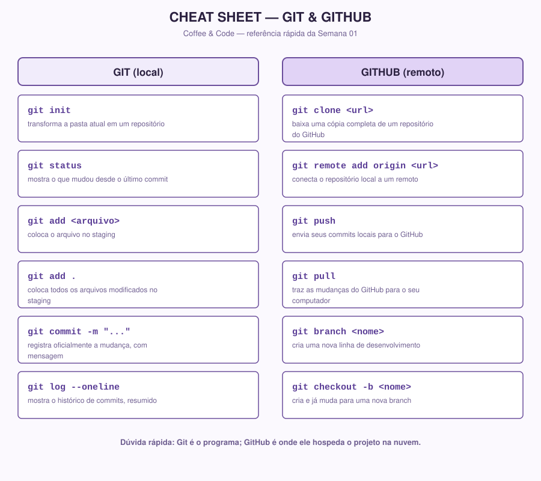

# Cheat Sheet — Git & GitHub

> Referência rápida dos comandos de Git e GitHub usados na Semana 01. Não é conteúdo novo — é só um resumo visual do que já foi explicado em `01-git.md` e `02-github.md`. Deixe esta aba aberta enquanto pratica.

## Versão em texto (para copiar/colar)

### Git (local)

| Comando | O que faz |
|---|---|
| `git init` | Transforma a pasta atual em um repositório |
| `git status` | Mostra o que mudou desde o último commit |
| `git add <arquivo>` | Coloca o arquivo no staging |
| `git add .` | Coloca todos os arquivos modificados no staging |
| `git commit -m "..."` | Registra oficialmente a mudança, com mensagem |
| `git log --oneline` | Mostra o histórico de commits, resumido |

### GitHub (remoto)

| Comando | O que faz |
|---|---|
| `git clone <url>` | Baixa uma cópia completa de um repositório do GitHub |
| `git remote add origin <url>` | Conecta o repositório local a um remoto |
| `git push` | Envia seus commits locais para o GitHub |
| `git pull` | Traz as mudanças do GitHub para o seu computador |
| `git branch <nome>` | Cria uma nova linha de desenvolvimento |
| `git checkout -b <nome>` | Cria e já muda para uma nova branch |

**Dúvida rápida:** Git é o programa; GitHub é onde ele hospeda o projeto na nuvem.
